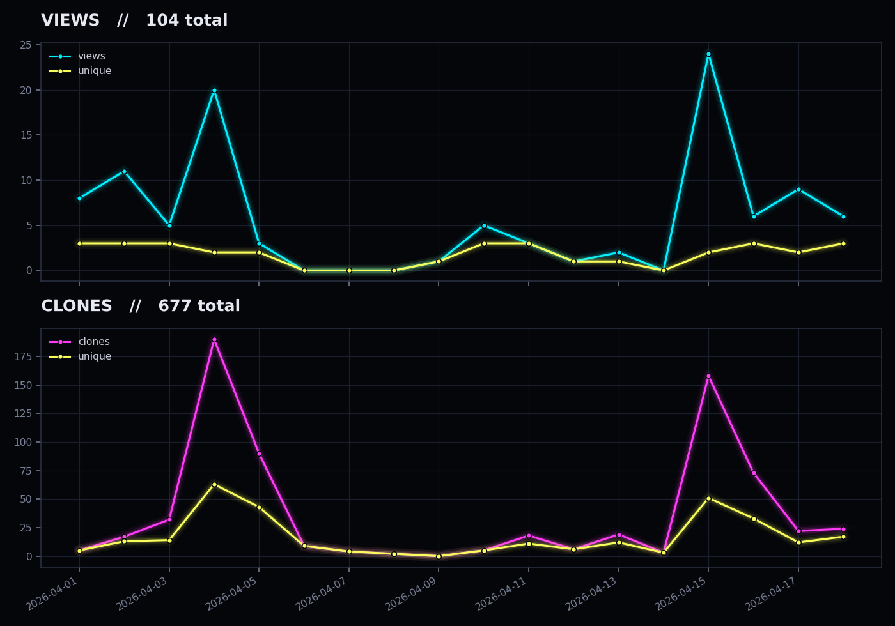
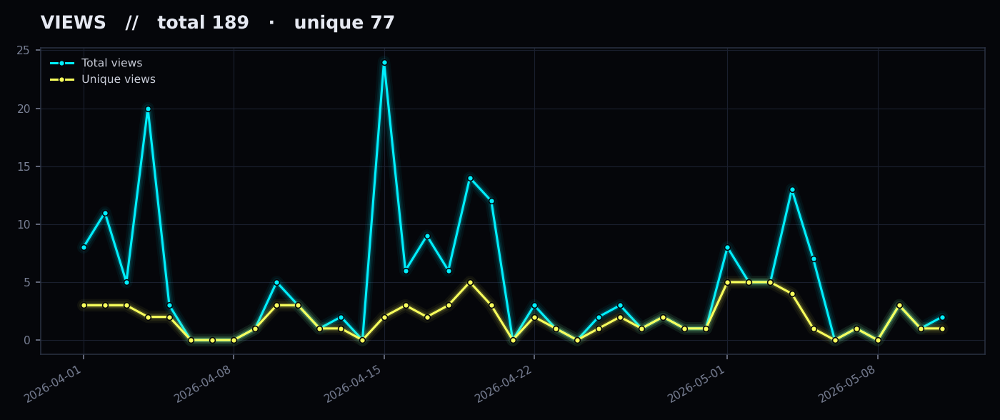
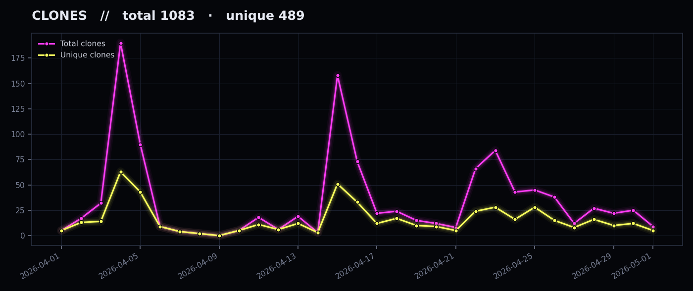

# Traffic Stats

Daily traffic snapshots for [ghost-ng/slinger](https://github.com/ghost-ng/slinger), collected by [.github/workflows/traffic.yml](https://github.com/ghost-ng/slinger/blob/main/.github/workflows/traffic.yml) to preserve history past GitHub's 14-day retention window.

## Summary

## Views

## Clones

## Layout

- `data/YYYY/MM/YYYY-MM-DD_*.json` — raw API snapshots (views, clones, popular paths/referrers, PyPI, releases)
- `charts/` — regenerated PNGs (dark theme, matplotlib)

Charts refresh daily at 06:17 UTC. Trigger manually with `gh workflow run traffic.yml` from the main branch.
