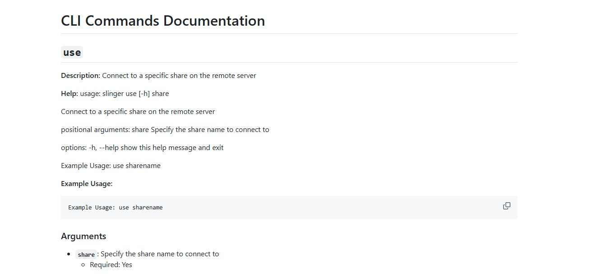

# Slinger


Slinger is a versatile tool designed for advanced network interactions and manipulations, with a focus on the SMB protocol. It offers a range of functionalities for interacting with remote systems, including managing scheduled tasks, handling Windows Registry operations, service management and gathering system information - **all in a single session**.  Slinger is built on the impacket framework and should offer a similar feel to impacket functions.

## Key Features

### Core Capabilities
- **🔌 Structured SMB Client** - Object-oriented SMB operations with intelligent session management
- **♾️ Persistent Impacket Sessions** - Maintain connections across multiple operations without re-authenticating
- **⚡ Multiple Command Execution Methods** - ATExec (Task Scheduler), WMI DCOM, WMI over SMB pipes, and cooperative agents
- **🎯 User-Friendly Custom CLI** - Interactive shell with tab completion, command history, and intuitive syntax
- **📚 Verbose Help Documentation** - Comprehensive help system with `help --verbose` for categorized command reference
- **🔧 Consolidated Impacket Features** - Unified interface for SMB, RPC, WMI, registry, services, secrets dumping, and more
- **🧩 Extensible Plugin System** - Easy-to-develop plugins for custom functionality

### Windows Administration
- **Registry Management** - Query, create, modify, and delete registry keys and values remotely
- **Service Control** - Full lifecycle management of Windows services (create, start, stop, delete, configure)
- **Task Scheduling** - Manage scheduled tasks via Task Scheduler
- **Remote Process Lists** - Enumerate running processes with PID, PPID, priority, threads, and handles
- **System Enumeration** - Logged-on users, shares, disks, network interfaces, named pipes
- **Event Log Analysis** - Query and analyze Windows Event Logs
- **Secrets Dumping** - Extract credentials via SAM/SYSTEM hives and LSA secrets

### Advanced Features
- **Cooperative Agent System** - Build polymorphic C++ agents with AES-256-GCM encryption and X25519 key exchange
- **Resumable Downloads** - Large file transfers with automatic checkpoint recovery
- **Command Chaining** - Execute command sequences from scripts or inline with semicolon separation
- **Network Utilities** - Port forwarding rules, firewall enumeration, IP configuration
- **Performance Monitoring** - Remote process enumeration and system metrics (experimental)

## Demo

[](https://asciinema.org/a/nvpgBJ3lh6Z2xfg98jSFsOpvM)

## Command Line Documentation

[](docs/cli_menu.md)


## Usage

```bash
python3 slinger.py -h

      __,_____
     / __.==--"   SLINGER
    /#(-'             v1.13.0
    `-'                    a ghost-ng special

usage: slinger.py [-h] [--host HOST] [-u USERNAME] [--pass PASSWORD | --ntlm NTLM | --kerberos]
                  [-d DOMAIN] [-p PORT] [--timeout TIMEOUT] [--nojoy] [--debug]
                  [--profile NAME] [--save-profile NAME] [--list-profiles]

impacket swiss army knife (sort of)

options:
  -h, --help            show this help message and exit
  --host HOST           Host to connect to
  -u, --user, --username USERNAME
                        Username for authentication
  -d, --domain DOMAIN   Domain for authentication (default: )
  -p, --port PORT       Port to connect to (default: 445)
  --timeout TIMEOUT     Global SMB connection timeout in seconds (default: 86400)
  --nojoy               Turn off emojis
  --verbose             Enable verbose output
  --debug               Turn on debug output
  --gen-ntlm-hash HASH  Generate NTLM hash from password
  -v, --version         Show version information

authentication (mutually exclusive):
  --pass, --password [PASSWORD]
                        Password for authentication
  --ntlm NTLM          NTLM hash for authentication
  --kerberos            Use Kerberos for authentication

connection profiles:
  --profile NAME        Load saved connection profile by name
  --save-profile NAME   Save connection as named profile after login
  --list-profiles       List saved connection profiles
```

Slinger offers multiple authentication methods. All methods are built on impacket functions and should therefore function the same. *Warning:* Kerberos login has not been fully tested.

### Login with password

```bash
python3 slinger.py --host 192.168.177.130 --user admin --pass admin

      __,_____
     / __.==--"   SLINGER
    /#(-'             v1.13.0
    `-'                    a ghost-ng special

[*] Connecting to 192.168.177.130:445...
[+] Successfully logged in to 192.168.177.130:445

Start Time: 2024-01-15 23:46:00.651408

[*] Checking the status of the RemoteRegistry service
[*] Service RemoteRegistry is in a stopped state
[*] Trying to start RemoteRegistry service
[+] Service RemoteRegistry is running
[+] Successfully logged in to 192.168.177.130:445
[sl] (192.168.177.130):\> exit
[*] Remote Registry state restored: RUNNING -> STOPPED
```

### Login with NTLM

```bash
python3 slinger.py --host 10.0.0.28 --user Administrator --ntlm :5E119EC7919CC3B1D7AD859697CFA659

      __,_____
     / __.==--"   SLINGER
    /#(-'             v1.13.0
    `-'                    a ghost-ng special

[*] Connecting to 10.0.0.28:445...
[+] Successfully logged in to 10.0.0.28:445

Start Time: 2024-01-15 23:42:15.410337

[*] Checking the status of the RemoteRegistry service
[*] Service RemoteRegistry is in a stopped state
[*] Trying to start RemoteRegistry service
[+] Service RemoteRegistry is running
[+] Successfully logged in to 10.0.0.28:445
[sl] (10.0.0.28):\> exit
[*] Remote Registry state restored: RUNNING -> STOPPED
```

### Login with profiles

```bash
# Save a profile after successful login
python3 slinger.py --host 10.0.0.28 --user Administrator --ntlm :hash --save-profile lab

# Connect using saved profile (credentials included)
python3 slinger.py --profile lab

# List saved profiles
python3 slinger.py --list-profiles
[*] Saved profiles (1):
  lab: Administrator@10.0.0.28:445 (ntlm, hash saved)
```

Profiles are stored in `~/.slinger/profiles/` with `chmod 600` permissions. Credentials (NTLM hash, password) are saved in the profile so you can reconnect with just `--profile <name>`. Command-line auth flags override stored credentials.

### Available Commands

```bash
Available commands (111):
------------------------------------------
!                     enumtransport         regcheck              showservice
#shell                env                   regcreate             showtask
agent                 eventlog              regdel                svcadd
atexec                exit                  regquery              svccreate
cat                   find                  regset                svcdelete
cd                    fwrules               regstart              svcdisable
clear                 get                   regstop               svcenable
config                hashdump              reguse                svcenum
debug-availcounters   help                  reload                svcshow
debug-counter         history               rm                    svcstart
disableservice        hostname              rmdir                 svcstop
disablesvc            ifconfig              run                   taskadd
download              info                  secretsdump           taskcreate
downloads             ipconfig              servertime            taskdel
enableservice         logoff                serviceadd            taskdelete
enablesvc             logout                servicecreate         taskenum
enumdisk              ls                    servicedel            taskexec
enuminfo              mget                  servicedelete         taskimport
enuminterfaces        mkdir                 servicedisable        tasklist
enumlogons            network               serviceenable         taskrm
enumpipes             plugins               servicerun            taskrun
enumservices          portfwd               services              tasksenum
enumshares            procs                 servicesenum          taskshow
enumsys               ps                    serviceshow           tasksshow
enumtasks             put                   servicestart          time
enumtime              pwd                   servicestop           upload
                      quit                  set                   use
                      reconnect             shares                who
                      regcheck              showservice           wmiexec

Type help <command> or <command> -h for more information on a specific command
Type help --verbose for detailed categorized help
```

#### Click here to view all the help entries:
[Help Entries](docs/cli_menu.md)


### Command Chaining
Slinger has two ways to execute a sequence of commands.

- Run a command chain through the CLI:
    run -c "cmd1;cmd2;cmd3"
- Run a series of commands from a script file, one command per line
    cmd1
    cmd2
    cmd3

```bash
run --help
usage: slinger run [-h] (-c CMD_CHAIN | -f FILE)

Run a slinger script or command sequence

options:
  -h, --help            show this help message and exit
  -c, --cmd-chain CMD_CHAIN
                        Specify a command sequence to run
  -f, --file FILE       Specify a script file to run

Example Usage: run -c "cmd1;cmd2;cmd3" | run -f script.txt
```


## Plugins

**System Audit** by [ghost-ng](https://github.com/ghost-ng/)

## Installation

### Development Installation
```bash
git clone https://github.com/ghost-ng/slinger.git
cd slinger
pipx install .
```

### Agent Build Dependencies

To build cooperative agents, install the following dependencies:

**Required:**
- CMake 3.15+
- MinGW-w64 cross-compiler (`x86_64-w64-mingw32-g++`, `i686-w64-mingw32-g++`)

**Automated Installation (Linux/macOS):**
```bash
python scripts/install_agent_deps.py
```

**Manual Installation:**

*Ubuntu/Debian:*
```bash
sudo apt update && sudo apt install cmake build-essential mingw-w64
```

*CentOS/RHEL:*
```bash
sudo yum groupinstall "Development Tools" && sudo yum install cmake mingw64-gcc-c++
```

*Fedora:*
```bash
sudo dnf groupinstall "Development Tools" && sudo dnf install cmake mingw64-gcc-c++
```

*macOS:*
```bash
brew install cmake mingw-w64
```

## Cooperative Agent System

Slinger includes a polymorphic C++ agent system for secure command execution over named pipes via SMB.

### Key Features
- **Polymorphic builds** - Unique binary signatures per build with obfuscation
- **Encrypted communication** - AES-256-GCM with X25519 key exchange
- **SMB transport** - Named pipes over TCP 445 only
- **Cross-architecture** - Windows x86/x64 support
- **Lifecycle management** - Deploy, execute, check, kill, remove agents

### Quick Start

**Build, deploy, and use:**
```bash
🤠 (10.0.0.28):> agent build --arch x64 --pass MySecretPass
🤠 (10.0.0.28):> use C$
🤠🔥 (10.0.0.28):\\C$> agent deploy ./slinger_agent_x64_12345.exe --path \\ --name updater --start
[*] Deploying agent: updater.exe
[+] Agent uploaded successfully
[*] Starting agent via WMI DCOM...
[+] Agent started successfully
🤠🔥 (10.0.0.28):\\C$> agent use updater
[*] Connecting to agent: updater
[+] Connected to agent pipe
[*] Performing passphrase authentication...
[+] Authentication successful - all communications encrypted

## agent:updater ## C:\> whoami
htb\administrator

## agent:updater ## C:\> exit
```

**Manage agents:**
```bash
🤠🔥 (10.0.0.28):\\C$> agent list                    # Show all deployed agents
🤠🔥 (10.0.0.28):\\C$> agent check updater            # Check if agent process is running
🤠🔥 (10.0.0.28):\\C$> agent kill updater              # Kill agent process
🤠🔥 (10.0.0.28):\\C$> agent start updater             # Restart agent (wmiexec or --method atexec)
🤠🔥 (10.0.0.28):\\C$> agent reset                     # Kill and remove all agents
```

**See it in action:**
- [Agent Demo Video](agent_demo.md) - Watch the cooperative agent system in action

For detailed documentation, run:
```bash
🤠 (10.0.0.28):> agent -h
```


## TODO

- see TODO.md

## Contributing

### Creating Your Own Plugin for Slinger

Contributions to the Slinger project, particularly in the form of plugins, are highly appreciated. If you're interested in developing a plugin, here's a guide to help you get started:

#### 1. Set Up Your Development Environment

- Fork the [Slinger repository](https://github.com/ghost-ng/slinger) and clone it to your local machine.
- Set up a Python development environment and install any necessary dependencies.

#### 2. Create a New Plugin

- Go to the `slinger/plugins` directory in your local repository.
- Create a new Python file for your plugin, e.g., `my_plugin.py`.
- Begin by importing the required modules, including the base plugin class:

  ```python
  from slinger.lib.plugin_base import PluginBase
  ```

#### 3. Develop Your Plugin

- Your plugin class should inherit from `PluginBase`.
- Implement the `get_parser` method to define the command-line interface for your plugin:

  ```python
  class MyPlugin(PluginBase):   <--required
      def get_parser(self):   <--required
        parser = argparse.ArgumentParser(add_help=False)   <--required
        subparsers = parser.add_subparsers(dest='command')   <--required
        plugincmd_parser = subparsers.add_parser("plugincmd", help="My plugin subparser")   <--required
        plugincmd_parser.add_argument("--plugincmd", help="My plugin argument")
        plugincmd_parser.set_defaults(func=self.run)   <--required
        return parser   <--required
  ```

- The `run` method can be used as an entry point for your plugin's functionality. It should be defined to handle the plugin's core logic.  Whatever the function name, it should be the same name as the function you added in the parser's "set_defaults" and it should accept "args" as a function parameter.

  ```python
  def run(self, args):
      # Your plugin's core functionality goes here
  ```

- Add any additional methods or attributes necessary for your plugin.
- **View the example plugin for additional help** [System Audit](src/slingerpkg/plugins/system_audit.py)

#### 4. Test Your Plugin

- Place your plugin in the ~/.slinger/plugin directory Thoroughly test your plugin to ensure it functions correctly and integrates seamlessly with Slinger.
- Ensure your plugin adheres to the coding standards and conventions of the project.

#### 5. Document Your Plugin

- Provide clear documentation for your plugin, detailing its purpose, usage, and any other important information.
- Update the `README.md` or other relevant documentation to include your plugin's details.

#### 6. Submit a Pull Request

- Once your plugin is complete and tested, push your changes to your fork and create a pull request to the main Slinger repository.
- Describe your plugin's functionality and any other pertinent details in your pull request.

### General Guidelines

- Write clean, well-documented code that follows the project's style guidelines.
- If applicable, write tests for your code.
- Keep pull requests focused – one feature or fix per request is ideal.

## Disclaimer

Please note that this software is provided as-is, and while we strive to ensure its quality and reliability, we cannot guarantee its performance under all circumstances. The authors and contributors are not responsible for any damage, data loss, or other issues that may occur as a result of using this software. Always ensure you have a backup of your data and use this software at your own risk.

Any likeness to other software, either real or fictitious, is purely coincidental unless otherwise stated. This software, unless otherwise stated, is unique and developed independently, and any similarities are not intended to infringe on any rights of the owners of similar software.
