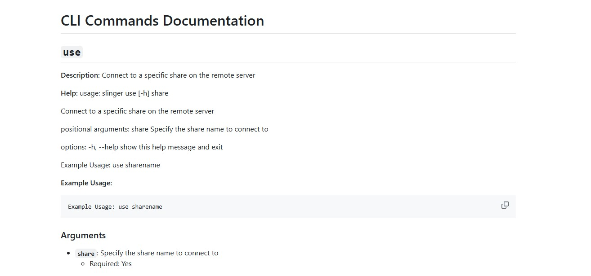

# Slinger


Slinger is a versatile tool designed for advanced network interactions and manipulations, with a focus on the SMB protocol. It offers a range of functionalities for interacting with remote systems, including managing scheduled tasks, handling Windows Registry operations, service management and gathering system information - **all in a single session**.  Slinger is built on the impacket framework and should offer a similar feel to impacket functions.

## Features

- **Extensible Plugin System**: Easily extend Slinger's functionality with custom plugins.
- **Network Interaction**: Facilitates various SMB-based operations and DCE/RPC transport setup.
- **Task Scheduling**: Manage task scheduling such as creating, deleting, and running.
- **Registry Management**: Manage registry operations such as querying keys, subkeys, and values, deleting, and much more!
- **Service Control**: Manage windows services through create, delete, and run functions
- **System Information Gathering**: Gather detailed system information, including server disk information, logged-on users, transport details, and server time/uptime via NetrRemoteTOD RPC.
- **Wrapper Commands**: Commands to edit port forwarding rules, view the windows firewall, ip information, etc
- **CLI System**: Slinger offers an exhaustively simple CLI complete with help entries
- **Query Performance Data**: (Experimental) Remotely query performance data like remote processes

## Demo

[](https://asciinema.org/a/nvpgBJ3lh6Z2xfg98jSFsOpvM)

## Command Line Documentation

[](cli_menu.md)


```
🤠 (10.0.0.28):\\> ps
[*] Retrieving Processes List...
[!] Performance Data querying is experimental and is still under development
Name                         PID    PPID    Priority    Threads    Handles
-------------------------  -----  ------  ----------  ---------  ---------
Idle                           0       0           0          1          0
System                         4       0           8         81        740
mmc (uuid:wVWpou)            152    1868           6         19        824
conhost                      172     248           6          2         54
cmd                          248    2836           6          1         26
svchost (uuid:LE9JOF)        428     712           8         14        779
smss                         440       4          11          2         52
csrss                        524     516          13          8        231
csrss (uuid:ZHvV4L)          616     608          13          8        243
vpnagent                     620     712          10          6        437
wininit                      624     516          13          1         79
winlogon                     652     608          13          2        157
services                     712     624           9          6        258
lsass                        720     624           9          6        694
svchost (uuid:HfKmym)        756     712           8         16        535
svchost                      780     712           8          7        358
svchost (uuid:1ngQeO)        808     712           8          6        327
dwm                          896     652          13          7        190
svchost (uuid:xqconX)        920     712           8         13        444
svchost (uuid:AwBbeG)        980     712           8         28       1000
rundll32                    1076     980          10          5        204
svchost (uuid:a31ADo)       1092     712           8         15        379
spoolsv                     1228     712           8          8        370
svchost (uuid:0wxSfV)       1260     712           8          6        118
svchost (uuid:Fwvb34)       1280     712           8          8        194
msdtc                       1292     712           8          9        163
dns                         1296     712           8         10      10224
svchost (uuid:tQ16ZP)       1392     712           8         10        253
VGAuthService               1432     712           8          2        114
vm3dservice                 1480     712           8          2         88
vmtoolsd                    1532     712          13         10        308
vm3dservice (uuid:rfz3k2)   1544    1480          13          2         85
svchost (uuid:i2Waqs)       1568     712           8         15        162
dllhost                     1976     712           8         10        192
vmtoolsd (uuid:OXMvuj)      1996    2628           8          9        231
WmiPrvSE                    2176     780           8         10        316
WmiPrvSE (uuid:elaPeM)      2312     780           8          7        234
taskhostex                  2540     980           8          5        201
vpnui                       2548    2952           8          6        356
Taskmgr                     2580    2628           8         10        305
explorer                    2628    2612           8         38       1304
taskeng                     2836     980           8          3        115
ServerManager               2988    2548           8          8        430
mmc                         3004    2628           8         19        403
[+] Proccesses with '(uuid:<random chars>)' have duplicate names but are unique processes
```

## Usage

```bash
python3 slinger.py -h

      __,_____
     / __.==--"   SLINGER
    /#(-'             v0.1.0
    `-'                    a ghost-ng special

usage: slinger.py [-h] --host HOST -u USERNAME -pass PASSWORD [-d DOMAIN] [-p PORT] [--nojoy] [--ntlm NTLM] [--kerberos] [--debug]

impacket swiss army knife (sort of)

options:
  -h, --help            show this help message and exit
  -host HOST            Host to connect to (default: None)
  -user USERNAME, --username USERNAME
                        Username for authentication (default: None)
  -domain DOMAIN, --domain DOMAIN
                        Domain for authentication (default: )
  -port PORT            Port to connect to (default: 445)
  -nojoy                Turn off emojis (default: False)
  -pass [PASSWORD], --password [PASSWORD]
                        Password for authentication (default: None)
  -ntlm NTLM            NTLM hash for authentication (default: None)
  -kerberos             Use Kerberos for authentication (default: False)
  -debug                Turn on debug output (default: False)
  -gen-ntlm-hash GEN_NTLM_HASH
                        Generate NTLM hash from password (default: None)
  -v, --version         Show version information
```

Slinger offers multiple authentication methods.  All methods are built on impacket functions and should therefore function the same.  *Warnining* at this time kerberos login has not been tested.

### Login with password

```bash
python3 slinger.py --host 192.168.177.130 --username admin --password admin

      __,_____
     / __.==--"   SLINGER
    /#(-'             v0.1.0
    `-'                    a ghost-ng special

[*] Connecting to 192.168.177.130:445...
[+] Successfully logged in to 192.168.177.130:445

Start Time: 2023-12-30 23:46:00.651408

[*] Checking the status of the RemoteRegistry service
[*] Service RemoteRegistry is in stopped state
[*] Trying to start RemoteRegistry service
[+] Remote Registry service started
[+] Successfully logged in to 192.168.177.130:445
🤠 (192.168.177.130):> exit
[*] Remote Registy state restored -> STOPPED

Stop Time: 2023-12-30 23:46:09.633701
```

### Login with NTLM

```bash
python3 slinger.py --host 10.0.0.28 --username Administrator --ntlm :5E119EC7919CC3B1D7AD859697CFA659

      __,_____
     / __.==--"   SLINGER
    /#(-'             v0.1.0
    `-'                    a ghost-ng special

[*] Connecting to 10.0.0.28:445...
[+] Successfully logged in to 10.0.0.28:445

Start Time: 2023-12-30 23:42:15.410337

[*] Checking the status of the RemoteRegistry service
[*] Service RemoteRegistry is in stopped state
[*] Trying to start RemoteRegistry service
[+] Remote Registry service started
[+] Successfully logged in to 10.0.0.28:445
🤠 (10.0.0.28):> exit
[*] Remote Registy state restored -> STOPPED

Stop Time: 2023-12-30 23:42:19.886846
```

### Available Commands

```bash
Available commands:
------------------------------------------
!                     get                   regstop               svcdelete
#shell                hashdump              reguse                svcdisable
cat                   help                  reload                svcenable
cd                    hostname              rm                    svcenum
config                ifconfig              rmdir                 svcshow
debug-availcounters   info                  run                   svcstart
debug-counter         ipconfig              secretsdump           svcstop
disableservice        logoff                serviceadd            taskadd
disablesvc            logout                servicecreate         taskcreate
download              ls                    servicedel            taskdel
enableservice         mget                  servicedelete         taskdelete
enablesvc             mkdir                 servicedisable        taskenum
enumdisk              plugincmd             serviceenable         taskexec
enuminfo              portfwd               servicerun            tasklist
enuminterfaces        procs                 services              taskrm
enumlogons            ps                    servicesenum          taskrun
enumservices          put                   serviceshow           tasksenum
enumshares            pwd                   servicestart          taskshow
enumsys               quit                  servicestop           tasksshow
enumtasks             regcheck              set                   upload
enumtime              regcreate             shares                use
enumtransport         regdel                showservice           who
env                   regquery              showtask
exit                  regset                svcadd
fwrules               regstart              svccreate

Type help <command> or <command> -h for more information on a specific command
```

#### Click here to view all the help entries:
[Help Entries](cli_menu)


### Command Chaining
Slinger has two ways to execute a sequence of commands.

- Run a command chain through the CLI:
    run -c "cmd1;cmd2;cmd3"
- Run a series of commands from a script file, one command per line
    cmd1
    cmd2
    cmd3

```bash
run -h
usage: slinger run [-h] (-c CMD_CHAIN | -f FILE)

Run a slinger script or command sequence

options:
  -h, --help            show this help message and exit
  -c CMD_CHAIN, --cmd_chain CMD_CHAIN
                        Specify a command sequence to run
  -f FILE, --file FILE  Specify a script file to run

Example Usage: run -c|-f [script]
```


## Plugins

**System Audit** by [ghost-ng](https://github.com/ghost-ng/)

## Installation

Clone the repository and install using one of the below methods:

### Using this Repo
```bash
git clone https://github.com/ghost-ng/slinger.git
cd slinger
pipx install .
```


## TODO

- see TODO.md

## Contributing

### Creating Your Own Plugin for Slinger

Contributions to the Slinger project, particularly in the form of plugins, are highly appreciated. If you're interested in developing a plugin, here's a guide to help you get started:

#### 1. Set Up Your Development Environment

- Fork the [Slinger repository](https://github.com/ghost-ng/slinger) and clone it to your local machine.
- Set up a Python development environment and install any necessary dependencies.

#### 2. Create a New Plugin

- Go to the `slinger/plugins` directory in your local repository.
- Create a new Python file for your plugin, e.g., `my_plugin.py`.
- Begin by importing the required modules, including the base plugin class:

  ```python
  from slinger.lib.plugin_base import PluginBase
  ```

#### 3. Develop Your Plugin

- Your plugin class should inherit from `PluginBase`.
- Implement the `get_parser` method to define the command-line interface for your plugin:

  ```python
  class MyPlugin(PluginBase):   <--required
      def get_parser(self):   <--required
        parser = argparse.ArgumentParser(add_help=False)   <--required
        subparsers = parser.add_subparsers(dest='command')   <--required
        plugincmd_parser = subparsers.add_parser("plugincmd", help="My plugin subparser")   <--required
        plugincmd_parser.add_argument("--plugincmd", help="My plugin argument")
        plugincmd_parser.set_defaults(func=self.run)   <--required
        return parser   <--required
  ```

- The `run` method can be used as an entry point for your plugin's functionality. It should be defined to handle the plugin's core logic.  Whatever the function name, it should be the same name as the function you added in the parser's "set_defaults" and it should accept "args" as a function parameter.

  ```python
  def run(self, args):
      # Your plugin's core functionality goes here
  ```

- Add any additional methods or attributes necessary for your plugin.
- **View the example plugin for additional help** [System Audit](src/slingerpkg/plugins/system_audit.py/)

#### 4. Test Your Plugin

- Place your plugin in the ~/.slinger/plugin directory Thoroughly test your plugin to ensure it functions correctly and integrates seamlessly with Slinger.
- Ensure your plugin adheres to the coding standards and conventions of the project.

#### 5. Document Your Plugin

- Provide clear documentation for your plugin, detailing its purpose, usage, and any other important information.
- Update the `README.md` or other relevant documentation to include your plugin's details.

#### 6. Submit a Pull Request

- Once your plugin is complete and tested, push your changes to your fork and create a pull request to the main Slinger repository.
- Describe your plugin's functionality and any other pertinent details in your pull request.

### General Guidelines

- Write clean, well-documented code that follows the project's style guidelines.
- If applicable, write tests for your code.
- Keep pull requests focused – one feature or fix per request is ideal.

## Disclaimer

Please note that this software is provided as-is, and while we strive to ensure its quality and reliability, we cannot guarantee its performance under all circumstances. The authors and contributors are not responsible for any damage, data loss, or other issues that may occur as a result of using this software. Always ensure you have a backup of your data and use this software at your own risk.

Any likeness to other software, either real or fictitious, is purely coincidental unless otherwise stated. This software, unless otherwise stated, is unique and developed independently, and any similarities are not intended to infringe on any rights of the owners of similar software.
